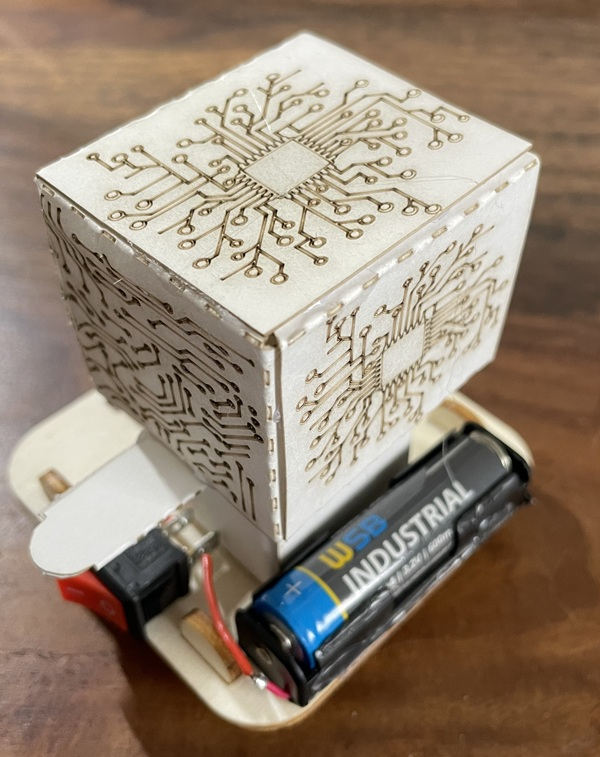

|[:skull:ISSUE](https://github.com/frankyhub/Wobble_Bot/issues?q=is%3Aissue)|[:speech_balloon: Forum /Discussion](https://github.com/frankyhub/Wobble_Bot/discussions)|[:grey_question:WiKi](https://github.com/frankyhub/Wobble_Bot/wiki)||
|--|--|--|--|
| | | | |
||<a href="https://github.com/frankyhub/Wobble_Bot/issues">|<a href="https://github.com/frankyhub/Wobble_Bot/discussions">|<a href="https://github.com/frankyhub/Wobble_Bot/releases">|
|| <a href="https://github.com/frankyhub/Wobble_Bot/pulse" alt="Activity">| <a href="https://github.com/frankyhub/Wobble_Bot/graphs/traffic">  |<a href="https://github.com/frankyhub?tab=stars"> |

---

## Story
Diese Anleitung beschreibt den Aufbau eines Wobble_Bots. Der Wobble_Bot ist auf eine Sperrholzplatte mit Füßen geklebt. Auf der Achse des Gleichstrommotors befindet sich ein 3D-Druckteil, das eine Unwucht erzeugt. Dadurch dreht sich der Wobble_bot.

 

## Hardware

| Stück | Beschreibung | 
| -------- | -------- | 
| 1        |Sperrholzplatte 600x300x3mm       |
| 1        |Karton für den PaperBot     |
| 1        | Mini Elektrischer Motor 1.5V-6V Speed 10000RPM       | 
| 1         | 3-D Druckteil (Unwucht)    | 
| 1         | Schalter     | 
| 1        | AA Baterie Case    | 
| 1       | 1,5V AA Batterie      | 
|    ---    | ---      | 

---

   
<ol class="breadcrumb" style="border-top: 2px solid black;border-bottom:2px solid black; height: 45px; width: 900px;"> 
<a href="#oben">nach oben</a>
</ol>

  

---
